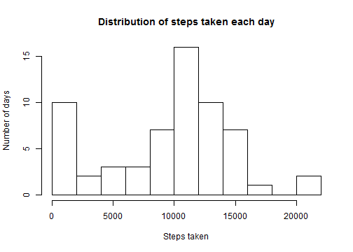
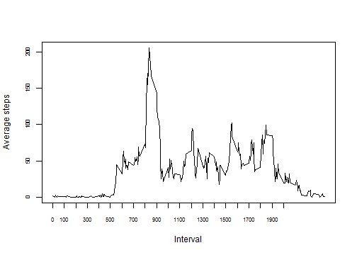
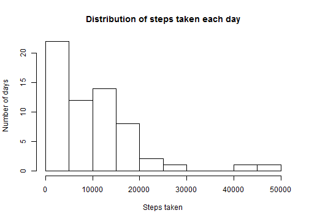
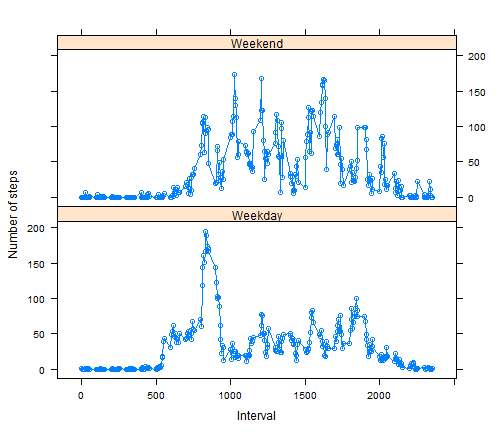

Peer assignement 1
========================================================

## Loading and preprocessing the data

### Loading data

```r
data<-read.csv("activity.csv")
```

### Converting date variable to date format

```r
data$date<-as.Date(data$date)
```

## What is mean total number of steps taken per day?

### Calculating total steps taken each day

```r
Steps_each_day<-aggregate(list(steps=data$steps),by=list(date=data$date),sum,na.rm=T)
```

### Developing a histogram of total steps taken each day

```r
hist(Steps_each_day$steps,ylab="Number of days",xlab="Steps taken",main="Distribution of steps taken each day",breaks=10)
```

 

### Calculating and displaying mean and median of total steps per day

```r
Mean_steps_per_day=mean(Steps_each_day$steps)
round(Mean_steps_per_day)
```

```
## [1] 9354
```

```r
Median_steps_per_day=median(Steps_each_day$steps)
Median_steps_per_day
```

```
## [1] 10395
```

## What is the average daily activity pattern?

### Calculating and plotting average steps taken in the 5 minute time intervals

```r
Steps_each_interval<-aggregate(list(steps=data$steps),by=list(interval=data$interval),mean,na.rm=T)
plot(Steps_each_interval$interval,Steps_each_interval$steps,ylab="Average steps",xlab="Interval",type='l',xaxp=c(0,2000,20),cex.axis=0.70)
```

 

### Identifying the 5-minute interval containing maximum steps

```r
lapply(Steps_each_interval,function(x) Steps_each_interval$interval[which(Steps_each_interval$steps==max(Steps_each_interval$steps))])$interval
```

```
## [1] 835
```

## Imputing missing values

### Reporting the number of missing values in the dataset

```r
sum(is.na(data$steps))
```

```
## [1] 2304
```

### Devising a strategy for filling in all of the missing values in the dataset

The missing values can be imputed by replacing them with the median for the corresponding 5 minute interval. Below are the reasons for taking this particular strategy:

1) Median of 5-minute interval is used instead of median of the day since number of steps seem to be influenced more significantly by the time of the day rather than the average activity on that particular day. For example the person will have 0 steps during his/her sleeping time and so it will be inaccurate to impute that period's activity with the average steps of the day.

2) Median is taken instead of mean since mean will result in non integral values which will not be sensible to represent number of steps which will always be integers.

### Creating a new dataset that with the missing data filled in

```r
median_steps_each_interval<-aggregate(list(median_steps=data$steps),by=list(interval=data$interval),median,na.rm=T)
data_with_imputed_values<-merge(data,median_steps_each_interval,by="interval")
data_with_imputed_values$steps[is.na(data_with_imputed_values$steps)]<-data_with_imputed_values$median_steps[is.na(data_with_imputed_values$steps)]
```

### Developing a historam of total steps taken each day and calculating mean and median to assess the impact of imputing missing values

```r
Steps_each_day_imputed<-aggregate(list(steps=data_with_imputed_values$steps),by=list(data_with_imputed_values=data$date),sum,na.rm=T)
hist(Steps_each_day_imputed$steps,ylab="Number of days",xlab="Steps taken",main="Distribution of steps taken each day",breaks=10)
```

 

```r
Mean_steps_per_day=mean(Steps_each_day_imputed$steps)
round(Mean_steps_per_day)
```

```
## [1] 9504
```

```r
Median_steps_per_day=median(Steps_each_day_imputed$steps)
Median_steps_per_day
```

```
## [1] 9155
```

The mean and median steps per day have decreased slighly after imputing missing values. This is because a large number of missing steps have been imputed as 0 since the median of the number of steps in the respective 5-minute period is 0. In the previous calculation missing values were ignored while calculating mean and median. Hence the mean and median values were higher in the previous calculation.

## Are there differences in activity patterns between weekdays and weekends?

### Creating a new factor variable in the dataset with two levels - "weekday" and "weekend"

```r
data_with_imputed_values$day_type=as.factor(ifelse(weekdays(data_with_imputed_values$date) %in% c("Satruday","Sunday"),"Weekend","Weekday"))
```

### Plotting average number of steps taken across the 5-minute interval during weekend/weekday

```r
data_by_day_type<-aggregate(list(steps=data_with_imputed_values$steps),by=list(interval=data_with_imputed_values$interval,day_type=data_with_imputed_values$day_type),mean)
library(lattice)
xyplot(steps~interval|day_type,data=data_by_day_type,layout=c(1,2),type='b',xlab="Interval",ylab="Number of steps")
```

 


